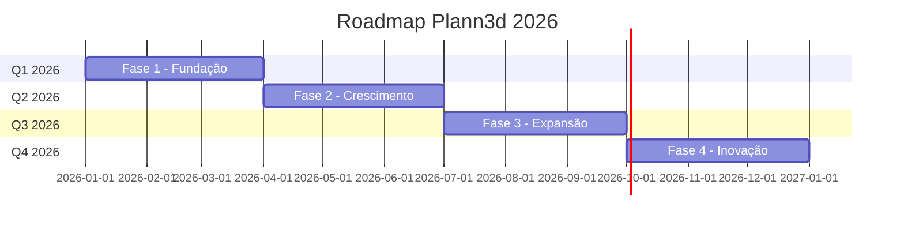

# 🚀 PLANN3D - Roadmap de Melhorias 2026

> Documento estratégico com oportunidades de melhoria e evolução do projeto Plann3d.

---

## 📋 Visão Geral

Este roadmap organiza as melhorias identificadas no projeto Plann3d em fases trimestrais, priorizando por impacto no negócio, experiência do usuário e qualidade técnica.



---

## 🚀 Oportunidades de Melhoria

### 1. Performance & Otimização ✅ IMPLEMENTADO

| Área        | Situação Atual                                              | Sugestão                                                                   | Status     |
| ----------- | ----------------------------------------------------------- | -------------------------------------------------------------------------- | ---------- |
| **Imagens** | ~~Usando `backgroundImage` com URLs diretas~~               | Implementar lazy loading com `<picture>` e formatos WebP/AVIF              | ✅ Feito   |
| **Código**  | ~~Código bem organizado mas sem code-splitting específico~~ | Adicionar dynamic imports para páginas e componentes pesados               | ✅ Feito   |
| **Assets**  | Vídeos carregados diretamente                               | Implementar preload para mídia crítica ou usar CDN (Cloudflare R2, AWS S3) | 🔄 Parcial |

---

### 2. Testes

- **Situação atual**: Vitest configurado mas sem testes visíveis na estrutura
- **Sugestão**: Adicionar:
  - Testes unitários para hooks (`useAnimatedSection`, `useLocale`)
  - Testes de integração para formulário de contato
  - E2E com Playwright para fluxos críticos

---

### 3. Projetos & Portfólio ✅ IMPLEMENTADO

| Oportunidade           | Descrição                                                                    | Status       |
| ---------------------- | ---------------------------------------------------------------------------- | ------------ |
| **Expandir portfólio** | ~~Atualmente só tem 1 projeto (`torre-de-tv`)~~, adicionados 2 mock projects | ✅ Feito     |
| **Filtros**            | Implementar filtros por categoria/tipo na página `/projects`                 | ✅ Já existe |
| **Pesquisa**           | Adicionar busca no portfólio                                                 | ✅ Feito     |
| **Paginação**          | Para quando houver muitos projetos                                           | ⏳ Pendente  |

---

### 4. SEO & Marketing 🔄 PARCIAL

| Item                       | Status          | Sugestão                                                                       |
| -------------------------- | --------------- | ------------------------------------------------------------------------------ |
| **Blog/Artigos**           | ❌ Não existe   | Criar seção de blog para conteúdo educativo sobre renderização 3D, cases, etc. |
| **Schema.org por projeto** | ✅ Implementado | Cada página de projeto agora tem schema dinâmico                               |
| **og-image**               | ✅ Implementado | Meta tags OG dinâmicas por projeto (heroImage)                                 |
| **Analytics**              | ⏳ Pendente     | Implementar Google Analytics 4 / Plausible / Fathom                            |

---

### 5. UX/UI Melhorias

| Área                 | Sugestão                                               | Status      |
| -------------------- | ------------------------------------------------------ | ----------- |
| **Skeleton loading** | Adicionar estados de carregamento para imagens/galeria | ✅ Feito    |
| **404 customizada**  | Criar página 404 branded                               | ⏳ Pendente |
| **Breadcrumbs**      | Adicionar navegação em páginas internas                | ⏳ Pendente |
| **Back to top**      | Botão para retornar ao topo em páginas longas          | ⏳ Pendente |
| **Progress bar**     | Indicador de scroll no header para páginas de projeto  | ⏳ Pendente |

---

### 6. Funcionalidades Novas

| Feature                      | Impacto                                       |
| ---------------------------- | --------------------------------------------- |
| **Calculadora de orçamento** | Formulário interativo para estimar projetos   |
| **Agendamento**              | Integração com Calendly/Cal.com para reuniões |
| **Chat/WhatsApp**            | Widget de contato rápido                      |
| **Depoimentos**              | Seção de testimonials de clientes             |
| **Parceiros/Clientes**       | Logo carousel de empresas atendidas           |

---

### 7. Técnico/DevOps

| Item                       | Sugestão                                         |
| -------------------------- | ------------------------------------------------ |
| **CI/CD**                  | Adicionar GitHub Actions para lint, test, build  |
| **Staging**                | Ambiente de preview para PRs                     |
| **Error monitoring**       | Sentry ou similar para captura de erros          |
| **Performance monitoring** | Web Vitals integrados (já tem a lib, falta usar) |
| **PWA**                    | Manifest já existe, completar service worker     |

---

### 8. Internacionalização

| Item                 | Sugestão                         |
| -------------------- | -------------------------------- |
| **Mais idiomas**     | Espanhol para mercado LATAM      |
| **URLs localizadas** | `/en/projects` vs `/pt/projects` |
| **hreflang tags**    | Garantir alternates corretos     |

---

### 9. Acessibilidade

- Revisar contraste de cores em modo claro/escuro
- Garantir navegação completa por teclado
- Adicionar skip links
- Melhorar labels ARIA em componentes interativos

---

### 10. Código & Arquitetura

| Área                             | Sugestão                                                |
| -------------------------------- | ------------------------------------------------------- |
| **Componente ProjectDetailPage** | Com 600+ linhas, pode ser refatorado em subcomponentes  |
| **CSS duplicado**                | Algumas classes `.light` podem virar utilities Tailwind |
| **Zod schemas**                  | Mover para arquivo separado para reuso                  |

---

## 📊 Priorização Sugerida

1. **🔴 Alta prioridade**: Mais projetos no portfólio, testes, analytics
2. **🟡 Média prioridade**: Blog, otimização de imagens, CI/CD
3. **🟢 Baixa prioridade**: PWA completo, novos idiomas, calculadora

---

## 🎯 Fase 1: Fundação (Q1 2026)

> **Foco**: Qualidade, estabilidade e conteúdo base

### 1.1 Portfólio & Conteúdo

| Item                       | Prioridade | Esforço | Descrição                                     |
| -------------------------- | ---------- | ------- | --------------------------------------------- |
| Adicionar mais projetos    | 🔴 Alta    | Médio   | Expandir de 1 para 5-10 projetos no portfólio |
| Depoimentos de clientes    | 🔴 Alta    | Baixo   | Seção de testimonials na home                 |
| Logo carousel de parceiros | 🟡 Média   | Baixo   | Credibilidade com logos de clientes atendidos |

#### Tarefas Técnicas

- [ ] Criar estrutura de dados para novos projetos em `src/data/projects/`
- [ ] Adicionar componente `<TestimonialsSection />` na home
- [ ] Implementar componente `<ClientLogos />` com animação marquee

---

### 1.2 Qualidade & Testes

| Item                 | Prioridade | Esforço | Descrição                             |
| -------------------- | ---------- | ------- | ------------------------------------- |
| Testes unitários     | 🔴 Alta    | Médio   | Cobertura para hooks e utilitários    |
| Testes de integração | 🔴 Alta    | Médio   | Formulário de contato e galeria       |
| CI/CD Pipeline       | 🔴 Alta    | Baixo   | GitHub Actions para lint, test, build |

#### Tarefas Técnicas

- [ ] Criar testes para `useAnimatedSection`, `useLocale`, `useToolRotation`
- [ ] Testes de integração para `contact.tsx` com MSW
- [ ] Configurar `.github/workflows/ci.yml`
- [ ] Adicionar Sentry para monitoramento de erros

---

### 1.3 Analytics & Métricas

| Item               | Prioridade | Esforço | Descrição                        |
| ------------------ | ---------- | ------- | -------------------------------- |
| Google Analytics 4 | 🔴 Alta    | Baixo   | Tracking de pageviews e eventos  |
| Web Vitals         | 🟡 Média   | Baixo   | Monitoramento de Core Web Vitals |
| Hotjar/Clarity     | 🟢 Baixa   | Baixo   | Heatmaps e gravações de sessão   |

#### Tarefas Técnicas

- [ ] Integrar GA4 via `@next/third-parties` ou script direto
- [ ] Implementar `reportWebVitals` usando `web-vitals` (já instalado)
- [ ] Adicionar eventos customizados para conversões

---

## 🌱 Fase 2: Crescimento (Q2 2026)

> **Foco**: SEO, marketing de conteúdo e otimização

### 2.1 Blog & Conteúdo

| Item                       | Prioridade | Esforço | Descrição                                    |
| -------------------------- | ---------- | ------- | -------------------------------------------- |
| Seção de Blog              | 🔴 Alta    | Alto    | Artigos sobre renderização, cases, tutoriais |
| Sistema de tags/categorias | 🟡 Média   | Médio   | Organização do conteúdo                      |
| RSS Feed                   | 🟢 Baixa   | Baixo   | Para agregadores e newsletters               |

#### Estrutura Proposta

```
src/
├── routes/
│   └── blog/
│       ├── index.tsx         # Lista de posts
│       └── $slug.tsx         # Post individual
├── data/
│   └── blog/
│       └── posts/            # Markdown/MDX posts
└── components/
    └── blog/
        ├── PostCard.tsx
        └── PostContent.tsx
```

#### Ideias de Conteúdo

1. "O que é Visualização Arquitetônica 3D?"
2. "Twinmotion vs Lumion: Qual escolher?"
3. "Como funciona o processo de renderização"
4. "Tendências de ArchViz para 2026"

---

### 2.2 SEO Avançado

| Item                             | Prioridade | Esforço | Descrição                                 |
| -------------------------------- | ---------- | ------- | ----------------------------------------- |
| OG Images dinâmicas              | 🟡 Média   | Médio   | Imagens únicas por projeto/página         |
| URLs localizadas                 | 🟡 Média   | Alto    | `/en/projects` vs `/pt/projects`          |
| Sitemap dinâmico                 | 🟡 Média   | Baixo   | Atualização automática com novos projetos |
| AEO (Answer Engine Optimization) | 🟡 Média   | Médio   | Otimização para LLMs e AI                 |

#### Tarefas Técnicas

- [ ] Implementar geração de OG images com Satori/`@vercel/og`
- [ ] Refatorar rotas para suporte a prefixo de idioma
- [ ] Automatizar sitemap.xml na build
- [ ] Expandir Schema.org com mais detalhes

---

### 2.3 Performance ✅ IMPLEMENTADO

| Item                         | Prioridade | Esforço | Descrição                       | Status      |
| ---------------------------- | ---------- | ------- | ------------------------------- | ----------- |
| Otimização de imagens        | 🔴 Alta    | Médio   | WebP/AVIF, lazy loading, srcset | ✅ Feito    |
| Code splitting               | 🟡 Média   | Baixo   | Dynamic imports para rotas      | ✅ Feito    |
| CDN para assets              | 🟡 Média   | Médio   | Cloudflare R2 ou AWS S3         | ⏳ Pendente |
| Preload de recursos críticos | 🟢 Baixa   | Baixo   | Fonts e hero images             | ✅ Feito    |

#### Tarefas Técnicas

- [x] Implementar componente `<OptimizedImage />` com blur placeholder
- [ ] Configurar Vite para gerar múltiplos formatos
- [x] Adicionar `loading="lazy"` em imagens abaixo do fold
- [ ] Configurar CDN e atualizar URLs de assets

---

## 📈 Fase 3: Expansão (Q3 2026)

> **Foco**: Novos recursos e conversão

### 3.1 Funcionalidades de Conversão

| Item                     | Prioridade | Esforço | Descrição                         |
| ------------------------ | ---------- | ------- | --------------------------------- |
| Calculadora de orçamento | 🔴 Alta    | Alto    | Estimativa interativa de projetos |
| Agendamento de reunião   | 🟡 Média   | Baixo   | Integração Cal.com/Calendly       |
| Widget WhatsApp          | 🟡 Média   | Baixo   | Chat rápido para dúvidas          |
| Download de materiais    | 🟢 Baixa   | Médio   | E-book, guias em troca de email   |

#### Calculadora de Orçamento - Wireframe

```
┌─────────────────────────────────────────┐
│  💰 Calculadora de Orçamento            │
├─────────────────────────────────────────┤
│  Tipo de Projeto:    [Renderização ▾]   │
│  Tamanho (m²):       [____] m²          │
│  Quantidade:         [____] imagens     │
│  Prazo:              [Normal ▾]         │
│  Extras:             ☐ Animação         │
│                      ☐ Tour Virtual     │
├─────────────────────────────────────────┤
│  Estimativa: R$ 3.500 - R$ 5.000        │
│                                         │
│  [Solicitar Orçamento Detalhado →]      │
└─────────────────────────────────────────┘
```

---

### 3.2 Filtros e Busca no Portfólio

| Item                      | Prioridade | Esforço | Descrição                             |
| ------------------------- | ---------- | ------- | ------------------------------------- |
| Filtros por categoria     | 🟡 Média   | Médio   | Residencial, Comercial, Institucional |
| Busca por texto           | 🟢 Baixa   | Médio   | Pesquisa em títulos e descrições      |
| Paginação/Infinite scroll | 🟢 Baixa   | Baixo   | Para portfólio extenso                |
| View toggle (grid/list)   | 🟢 Baixa   | Baixo   | Alternativa de visualização           |

---

### 3.3 Internacionalização Avançada

| Item                        | Prioridade | Esforço | Descrição                       |
| --------------------------- | ---------- | ------- | ------------------------------- |
| Espanhol (LATAM)            | 🟡 Média   | Médio   | Mercado hispanohablante         |
| Seletor de idioma melhorado | 🟢 Baixa   | Baixo   | Dropdown com bandeiras          |
| Conteúdo localizado         | 🟢 Baixa   | Alto    | Projetos específicos por região |

---

## 🔮 Fase 4: Inovação (Q4 2026)

> **Foco**: Diferenciação e tecnologia de ponta

### 4.1 Experiências Imersivas

| Item                 | Prioridade | Esforço | Descrição                      |
| -------------------- | ---------- | ------- | ------------------------------ |
| Viewer 3D interativo | 🟡 Média   | Alto    | Three.js/React Three Fiber     |
| Tour virtual 360°    | 🟡 Média   | Alto    | Embed de tours Matterport-like |
| Preview em AR        | 🟢 Baixa   | Alto    | Model Viewer para mobile       |

#### Stack Sugerida

- **Three.js** + **React Three Fiber** para 3D
- **Pannellum** ou **A-Frame** para 360°
- **model-viewer** para AR

---

### 4.2 PWA Completo

| Item               | Prioridade | Esforço | Descrição                   |
| ------------------ | ---------- | ------- | --------------------------- |
| Service Worker     | 🟢 Baixa   | Médio   | Cache e offline support     |
| Install prompt     | 🟢 Baixa   | Baixo   | Promover instalação do app  |
| Push notifications | 🟢 Baixa   | Médio   | Novos projetos e blog posts |

---

### 4.3 Integrações Avançadas

| Item            | Prioridade | Esforço | Descrição                              |
| --------------- | ---------- | ------- | -------------------------------------- |
| CRM Integration | 🟡 Média   | Médio   | HubSpot, Pipedrive                     |
| Email marketing | 🟡 Média   | Baixo   | Newsletter automática                  |
| Área do cliente | 🟢 Baixa   | Alto    | Portal para acompanhamento de projetos |

---

## 🛠️ Melhorias Técnicas Contínuas

> Itens a serem trabalhados ao longo de todas as fases

### Refatoração de Código

| Arquivo          | Problema                     | Solução                                                                    |
| ---------------- | ---------------------------- | -------------------------------------------------------------------------- |
| `$projectId.tsx` | 600+ linhas                  | Extrair para subcomponentes: `HeroSection`, `PhaseSection`, `SpecsSection` |
| `styles.css`     | Classes `.light` repetitivas | Converter para utilities Tailwind                                          |
| `contact.tsx`    | Schema Zod inline            | Mover para `src/lib/schemas.ts`                                            |

### Acessibilidade (WCAG 2.1)

- [ ] Auditoria completa de contraste
- [ ] Skip links no início das páginas
- [ ] Focus management em modais
- [ ] Labels ARIA em todos componentes interativos
- [ ] Testes com leitor de tela

### DevOps & Infraestrutura

- [ ] Ambiente de staging/preview
- [ ] Branch protection rules
- [ ] Semantic versioning
- [ ] Changelog automático
- [ ] Performance budgets no CI

---

## 📊 Métricas de Sucesso

### KPIs por Fase

| Fase | Métrica                        | Meta  |
| ---- | ------------------------------ | ----- |
| Q1   | Projetos no portfólio          | ≥5    |
| Q1   | Cobertura de testes            | ≥60%  |
| Q2   | Artigos publicados             | ≥4    |
| Q2   | LCP (Largest Contentful Paint) | <2.5s |
| Q3   | Taxa de conversão (formulário) | ≥3%   |
| Q3   | Tempo médio na página          | ≥2min |
| Q4   | Score Lighthouse               | ≥90   |
| Q4   | Usuários recorrentes           | ≥20%  |

---

## 💡 Quick Wins (Implementação Imediata)

Itens de baixo esforço e alto impacto que podem ser feitos rapidamente:

1. **Página 404 customizada** (~30min)
2. **Botão "Back to top"** (~1h)
3. **Widget WhatsApp** (~30min)
4. **Breadcrumbs** (~1h)
5. **Skeleton loading para imagens** (~2h)
6. **Meta tags dinâmicas por página** (~1h)

---

## 📝 Notas Finais

### Dependências Externas

- Conteúdo de novos projetos (assets, descrições)
- Depoimentos reais de clientes
- Decisão sobre ferramentas de analytics/CRM

### Riscos

- **Prazo**: Blog exige criação contínua de conteúdo
- **Recursos**: Features 3D podem requerer expertise adicional
- **Budget**: CDN e ferramentas pagas

### Próximos Passos

1. Validar prioridades com stakeholders
2. Criar issues no GitHub para Fase 1
3. Definir sprint planning
4. Começar pelos Quick Wins

---

> 📅 **Última atualização**: 04 de Janeiro de 2026  
> 📧 **Contato**: plann3d@gmail.com
